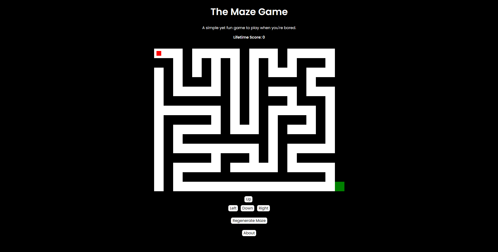

# The Maze Game

🚀 A simple yet engaging maze game built by [Son Nguyen](https://github.com/hoangsonww) in 2024 with **DFS and Prim algorithms**. Navigate through a dynamically generated maze to find the exit. Each time you play, a new maze is created, ensuring a unique experience. The game is designed to be lightweight and easy to play, making it suitable for all age groups. 

However, creating it is a pain in the brain, so I hope you'll enjoy it! Star the repository if you like it and feel free to contribute to the project 🌟.

Feel free to give it a try at [The Maze Game](https://hoangsonww.github.io/The-Maze-Game/)!

## Game UI

<p align="center">
  
</p>

## Features

- **Randomized Maze Generation**: Each game loads a new maze, thanks to the **Depth-First Search (DFS)** and **Prim algorithms** used for maze generation.
- **Player Navigation**: Use the arrow keys to move up, down, left, or right within the maze.
- **Start and Exit Indicators**: The game visually indicates the starting point and the exit. Reach the green block to win.
- **Regenerate Maze**: A button allows players to generate a new maze at any time without reloading the page.
- **Responsive Design**: The game canvas is responsive and adapts to different screen sizes, making it playable on both desktop and mobile devices.
- **On-Screen Controls**: For mobile users, on-screen buttons are provided to navigate the player within the maze.
- **Lifetime Score**: The game keeps track of the number of times you reach the exit. Try to complete the maze in the fewest moves possible, too!

## Technologies Used

- **HTML**: Structure of the game canvas and control elements.
- **CSS**: Styling of the game canvas and alignment of game elements.
- **JavaScript**: Game logic, including maze generation, player movement, collision detection, and UI interaction. Implemented using DFS and Prim algorithms.
- **Python**: There is also a Python implementation of the maze generation algorithm using the Depth-First Search (DFS) algorithm.
- **Pygame**: A Python library used for creating the maze generation visualization.

## Maze Generation Algorithm

The maze is generated using a randomized version of the Depth-First Search (DFS) & Prim algorithms. This algorithm starts at a random cell, marks it as part of the maze, and recursively explores unvisited neighbors, carving out a path. The process continues until all cells are visited, resulting in a perfect maze with a single solution.

## Setup

1. Clone the repository to your local machine.
2. Open the `index.html` file in a modern web browser.
3. Alternatively, you can run the Python implementation of the maze generation algorithm by executing the `main.py` file.

```bash
python main.py
```

Before running the Python script, ensure that you have Python and Pygame installed on your machine.
```bash
pip install pygame
```

or 
    
```bash
pip install -r requirements.txt
```

## Usage

- Navigate through the maze using the **arrow keys** or the **on-screen controls buttons**.
- Click the **Regenerate Maze** button below the canvas to start a new game with a new maze layout.

## Contribution

Feel free to fork the repository and submit pull requests to contribute to the game's development. Whether it's adding new features, improving the maze generation algorithm, or enhancing the game's UI/UX, all contributions are welcome.

## License

This project is open-source and available under the MIT License. See the [LICENSE](../LICENSE) file for more information.

## Contact

You can reach out to me at [info@movie-verse.com](mailto:info@movie-verse.com) if you have any queries or feedback regarding the project.

---

Created with ❤️ in 2024 by [Son Nguyen](https://github.com/hoangsonww). Thank you for visiting and playing the game! 🚀
