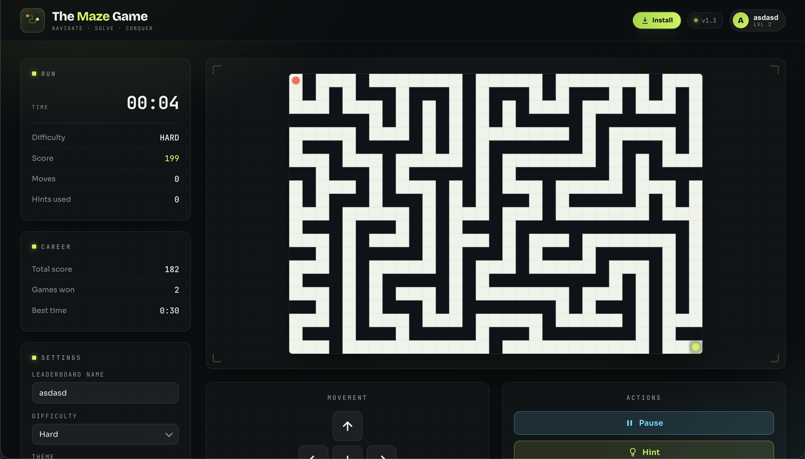

# The Maze Game

🚀 A maze game by [Son Nguyen](https://github.com/hoangsonww) — navigate procedurally generated mazes built with a randomized **Depth-First Search** algorithm. Pick a difficulty, race the timer, use A\* hints, climb the global leaderboard, unlock achievements, and (optionally) create an account to track your stats and progress.

⭐ Star the repo if you like it, and contributions are welcome!

▶️ **[Play now](https://hoangsonww.github.io/The-Maze-Game/)** · 📚 **[API docs (Swagger)](https://maze-game-api.vercel.app/api-docs)** · 📖 **[Full README](../README.md)**

## Game UI

<p align="center">
  
</p>

## Features

- **Procedural mazes** — a new, always-solvable maze every game (randomized DFS).
- **Difficulty levels** — Easy, Medium, Hard, Expert (11×15 → 25×35).
- **Timer, scoring & A\* hints** — race the clock; hints cost points.
- **10 themes** — Daylight, Midnight, Neon, Forest, Sunset, Ocean, Dracula, Mono, Candy, Volcano. **Sound**, **pause**, **swipe** controls.
- **Accounts & progress** — sign in (JWT) to track level/XP, win rate, streaks, per-difficulty stats, and recent games. Editable profile, password reset, and guest names for anonymous players.
- **Global leaderboards** with daily/weekly/monthly filters and **achievements**.
- **Backend API** — Node/Express on Vercel, MongoDB-backed, documented with **Swagger** (`/api-docs`).
- **Fully responsive** — presentable and playable on phones (swipe + on-screen D-pad), tested down to ~360px.
- **PWA** — installable, offline-capable. **Python/Pygame** version included.

## Tech

HTML5 Canvas · vanilla JS · CSS3 · Node.js/Express · MongoDB (PostgreSQL switchable) · Socket.IO · JWT/bcrypt · Swagger/OpenAPI · Jest · Docker · Python/Pygame.

## Run it

**Play:** open [the live site](https://hoangsonww.github.io/The-Maze-Game/), or open `index.html` locally.

**Backend (optional):**

```bash
npm install
npm run dev          # API + Swagger UI at http://localhost:3000/api-docs
```

**Python version:**

```bash
pip install -r requirements.txt
python src/python/main.py
```

See the [full README](../README.md) for deployment (Vercel / Docker / GitHub Pages) and the [API documentation](../API_DOCUMENTATION.md).

## License

MIT — see [LICENSE](../LICENSE).

## Contact

Questions or feedback? Open an [issue](https://github.com/hoangsonww/The-Maze-Game/issues) or a [discussion](https://github.com/hoangsonww/The-Maze-Game/discussions).

---

Created with ❤️ by [Son Nguyen](https://github.com/hoangsonww). Thanks for playing! 🚀
