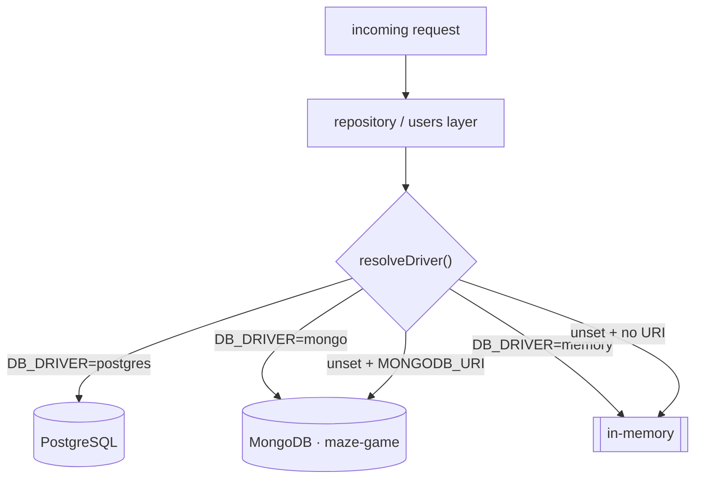
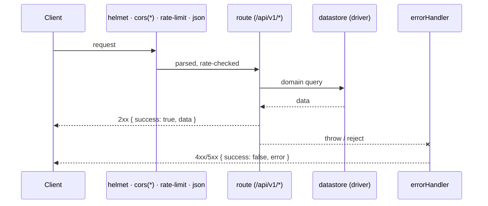
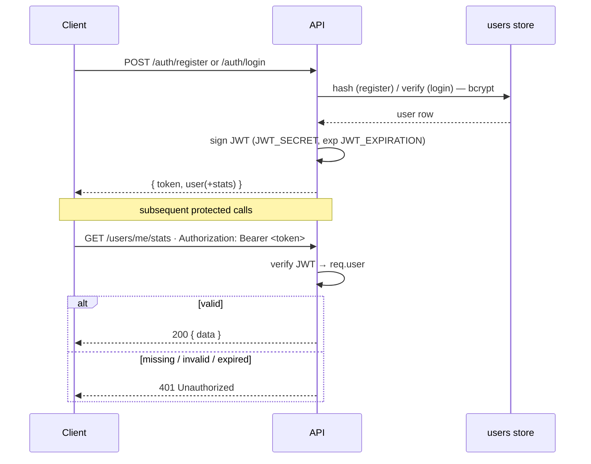
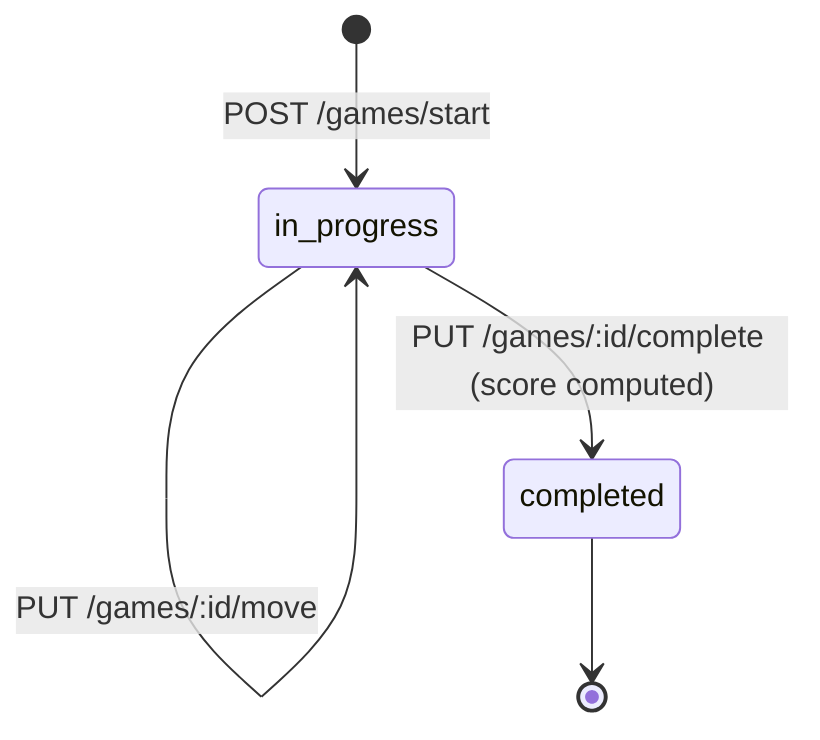

# The Maze Game — API Documentation

REST API for The Maze Game: leaderboard, game sessions, achievements, accounts,
and per-user stats/progress.

> **Interactive docs:** the running server serves **Swagger UI** at
> [`/api-docs`](https://maze-game-api.vercel.app/api-docs) and the raw OpenAPI
> 3.0 spec at [`/openapi.json`](https://maze-game-api.vercel.app/openapi.json).
> Visiting `/` redirects to the docs.

## Base URL

```
Production:  https://maze-game-api.vercel.app
Local:       http://localhost:3000
```

All versioned endpoints live under `/api/v1`.

## Datastore

The API runs on one of three interchangeable drivers (selected by `DB_DRIVER`):

| Driver     | When                                       | Notes                                       |
| ---------- | ------------------------------------------ | ------------------------------------------- |
| `mongo`    | default when `MONGODB_URI` is set (active) | MongoDB, database `maze-game`               |
| `postgres` | `DB_DRIVER=postgres`                       | tables in `server/database/schema-game.sql` |
| `memory`   | no DB configured / tests                   | process-local, non-persistent               |

`GET /api/health` reports the resolved driver.



## Request lifecycle

Every call passes the same middleware chain; thrown errors short-circuit to a
single JSON error formatter.



## Authentication

- **Anonymous play** (leaderboard, game sessions, achievements) needs no auth —
  players are identified by a `playerId` stored in `localStorage`.
- **Accounts** use a **JWT bearer token**. Register or log in to receive a token,
  then send it on protected endpoints:

  ```
  Authorization: Bearer <token>
  ```

Passwords are hashed with bcrypt and never returned. Set `JWT_SECRET` on the
server to enable accounts.



## CORS & Rate Limiting

- **CORS:** all origins are allowed (no credentials).
- **Rate limit:** 100 requests / 15 minutes per IP on `/api/*`
  (tunable via `RATE_LIMIT_WINDOW_MS` / `RATE_LIMIT_MAX_REQUESTS`).

---

## Health

### `GET /api/health`

```json
{
  "status": "healthy",
  "timestamp": "2026-06-03T04:00:00.000Z",
  "uptime": 123.4,
  "environment": "production",
  "dbDriver": "mongo"
}
```

---

## Auth

### `POST /api/v1/auth/register`

Create an account.

**Body**

```json
{
  "username": "string, 3-20 chars (letters, numbers, underscores)",
  "email": "string, valid email",
  "password": "string, min 6 chars"
}
```

**Response** `201`

```json
{
  "success": true,
  "data": {
    "token": "<jwt>",
    "user": {
      "id": "665f...",
      "username": "mazerunner",
      "email": "me@example.com",
      "role": "user",
      "createdAt": "2026-06-03T04:00:00.000Z",
      "lastLogin": "2026-06-03T04:00:00.000Z",
      "stats": { "...": "see Stats object" },
      "recentGames": []
    }
  }
}
```

**Errors:** `400` validation · `409` username/email already taken

### `POST /api/v1/auth/login`

Log in with username **or** email.

**Body**

```json
{ "login": "mazerunner", "password": "secret" }
```

**Response** `200` — same shape as register (`{ token, user }`).
**Errors:** `400` missing fields · `401` invalid credentials

### `GET /api/v1/auth/me` 🔒

Returns the current account with a decorated stats object.

```json
{ "success": true, "data": { "id": "...", "username": "...", "stats": { "...": "..." } } }
```

**Errors:** `401` missing/invalid token

### `POST /api/v1/auth/reset/verify`

Password reset, **step 1** — confirm a `username` + `email` pair belongs to one
account.

```json
{ "username": "mazerunner", "email": "me@example.com" }
```

**Response** `200` `{ "success": true, "data": { "verified": true } }`.
**Errors:** `400` missing fields · `404` no matching account

### `POST /api/v1/auth/reset`

Password reset, **step 2** — set a new password (re-verifies the username +
email, then logs in).

```json
{ "username": "mazerunner", "email": "me@example.com", "password": "newpass1" }
```

**Response** `200` — `{ token, user }` (same shape as login).
**Errors:** `400` validation · `404` no matching account

> This is an intentionally lightweight reset (knowledge of username + email is
> sufficient). For a hardened flow, add emailed reset tokens.

---

## Users & Stats

### `GET /api/v1/users/me/stats` 🔒

Current user's decorated [Stats object](#stats-object).

### `POST /api/v1/users/me/games` 🔒

Record a finished game against the user's stats and progress. The game client
calls this automatically on every win when signed in.

**Body**

```json
{
  "difficulty": "easy|medium|hard|expert",
  "score": 145,
  "timeMs": 17000,
  "moves": 80,
  "won": true
}
```

**Response** `201` — the updated decorated [Stats object](#stats-object).

### `PATCH /api/v1/users/me` 🔒

Update the signed-in user's `username` and/or `email`.

```json
{ "username": "newname", "email": "new@example.com" }
```

**Response** `200` — the updated decorated profile.
**Errors:** `400` validation / nothing to update · `409` username/email taken

### `POST /api/v1/users/me/password` 🔒

Change the signed-in user's password.

```json
{ "password": "newpass1" }
```

**Response** `200` `{ "success": true, "data": { "message": "Password updated" } }`.
**Errors:** `400` too short

### `GET /api/v1/users/:id`

Public profile (username + stats; email and recent games omitted).

**Errors:** `404` user not found

---

## Leaderboard

### `GET /api/v1/leaderboard`

| Param       | Type    | Default | Description                            |
| ----------- | ------- | ------- | -------------------------------------- |
| `limit`     | integer | 100     | Max entries (capped at 1000)           |
| `offset`    | integer | 0       | Entries to skip                        |
| `timeframe` | string  | `all`   | `all` · `daily` · `weekly` · `monthly` |

```json
{
  "success": true,
  "count": 1,
  "total": 1,
  "data": [
    {
      "id": "665f...",
      "playerName": "Player1",
      "score": 150,
      "completionTime": 45000,
      "difficulty": "medium",
      "moves": 50,
      "timestamp": 1780459510743
    }
  ]
}
```

### `POST /api/v1/leaderboard`

**Body**

```json
{
  "playerName": "string, required, max 20",
  "score": "integer, required",
  "completionTime": "integer, required, ms",
  "difficulty": "easy|medium|hard|expert (optional)",
  "moves": "integer (optional)"
}
```

**Response** `201` — the created entry. **Errors:** `400` validation.

### `GET /api/v1/leaderboard/rank/:playerName`

```json
{
  "success": true,
  "data": { "rank": 5, "entry": { "...": "..." }, "totalEntries": 100 }
}
```

**Errors:** `404` player not found

---

## Game Sessions

A server-side session tracks a single play from start to completion. Moves
increment a counter; completion computes the score (see
[Score Calculation](#score-calculation)).



### `POST /api/v1/games/start`

**Body**

```json
{ "playerId": "player_123", "difficulty": "medium", "mode": "single" }
```

**Response** `201`

```json
{
  "success": true,
  "data": {
    "id": "665f...",
    "playerId": "player_123",
    "difficulty": "medium",
    "mode": "single",
    "startTime": 1780459510743,
    "moves": 0,
    "hintsUsed": 0,
    "status": "in_progress"
  }
}
```

### `PUT /api/v1/games/:id/move`

Increments the session move count. **Errors:** `404` not found · `400` not active.

### `PUT /api/v1/games/:id/complete`

Marks the session complete and computes the score (see [Score Calculation](#score-calculation)).

```json
{
  "success": true,
  "data": { "id": "...", "status": "completed", "completionTime": 45000, "score": 150 }
}
```

### `GET /api/v1/games/stats`

```json
{
  "success": true,
  "data": {
    "totalGames": 1000,
    "averageCompletionTime": 52000,
    "averageMoves": 60,
    "averageScore": 120
  }
}
```

---

## Achievements

### `GET /api/v1/achievements`

All available achievements (`{ success, count, data: [...] }`). See the
[Achievements list](#achievements-list).

### `GET /api/v1/achievements/user/:userId`

```json
{
  "success": true,
  "data": {
    "achievements": [
      {
        "id": "first_win",
        "name": "First Victory",
        "description": "Complete your first maze",
        "icon": "🏆",
        "points": 10,
        "unlocked": true,
        "unlockedAt": "2026-06-03T04:00:00.000Z"
      }
    ],
    "totalPoints": 10
  }
}
```

### `POST /api/v1/achievements/unlock`

**Body**

```json
{ "userId": "string, required", "achievementId": "string, required" }
```

**Response** `201` — the unlocked achievement.
**Errors:** `400` missing fields / already unlocked · `404` achievement not found

> For signed-in players the client passes the account id as `userId`, so
> achievements follow the account.

---

## Stats object

Returned (decorated) by `GET /auth/me`, `GET /users/me/stats`, and
`POST /users/me/games`:

```json
{
  "gamesPlayed": 12,
  "gamesWon": 9,
  "totalScore": 1340,
  "bestScore": 240,
  "currentStreak": 3,
  "bestStreak": 5,
  "totalTimeMs": 412000,
  "byDifficulty": {
    "easy": { "played": 3, "won": 3, "bestTime": 9000, "bestScore": 90 },
    "medium": { "played": 5, "won": 4, "bestTime": 15000, "bestScore": 160 },
    "hard": { "played": 3, "won": 2, "bestTime": 40000, "bestScore": 220 },
    "expert": { "played": 1, "won": 0, "bestTime": null, "bestScore": 0 }
  },
  "winRate": 75,
  "level": 6,
  "levelProgress": 42,
  "nextLevelScore": 1800
}
```

`level`, `levelProgress`, `nextLevelScore`, and `winRate` are computed from
`totalScore` / wins (raw rows don't store them).

---

## Postgres-only groups (Social · Challenges · Mazes · Admin)

These endpoint groups are fully implemented and **documented in Swagger** (with
every parameter, body, and example) but require the PostgreSQL driver
(`DB_DRIVER=postgres`) — they are inactive on the default Mongo deployment.
Browse them interactively at [`/api-docs`](https://maze-game-api.vercel.app/api-docs).

| Method | Endpoint                                         | Auth     | Summary                                            |
| ------ | ------------------------------------------------ | -------- | -------------------------------------------------- |
| GET    | `/api/v1/social/friends`                         | 🔒       | List accepted friends                              |
| GET    | `/api/v1/social/friend-requests`                 | 🔒       | Incoming pending requests                          |
| POST   | `/api/v1/social/friend-request`                  | 🔒       | Send a request (`{ friendId }`)                    |
| PUT    | `/api/v1/social/friend-request/:id`              | 🔒       | Accept/reject (`{ action }`)                       |
| DELETE | `/api/v1/social/friends/:id`                     | 🔒       | Remove a friend                                    |
| GET    | `/api/v1/social/search?q=`                       | 🔒       | Search users (q ≥ 2 chars)                         |
| GET    | `/api/v1/social/activity`                        | 🔒       | Friends' recent games                              |
| GET    | `/api/v1/challenges/daily`                       | —        | Today's daily challenge                            |
| POST   | `/api/v1/challenges/daily/complete`              | 🔒       | Submit result                                      |
| GET    | `/api/v1/challenges/daily/leaderboard`           | —        | Daily leaderboard                                  |
| GET    | `/api/v1/challenges/tournaments`                 | —        | Upcoming/active tournaments                        |
| POST   | `/api/v1/challenges/tournaments/:id/join`        | 🔒       | Join a tournament                                  |
| GET    | `/api/v1/challenges/tournaments/:id/leaderboard` | —        | Tournament leaderboard                             |
| GET    | `/api/v1/mazes/custom`                           | —        | Browse public mazes (page/limit/sortBy/difficulty) |
| POST   | `/api/v1/mazes/custom`                           | 🔒       | Create a custom maze                               |
| GET    | `/api/v1/mazes/custom/:id`                       | —        | Get a maze                                         |
| PUT    | `/api/v1/mazes/custom/:id`                       | 🔒       | Update your maze                                   |
| DELETE | `/api/v1/mazes/custom/:id`                       | 🔒       | Delete your maze                                   |
| POST   | `/api/v1/mazes/custom/:id/play`                  | —        | Increment play count                               |
| POST   | `/api/v1/mazes/custom/:id/rate`                  | 🔒       | Rate 1–5                                           |
| GET    | `/api/v1/mazes/my`                               | 🔒       | Your custom mazes                                  |
| GET    | `/api/v1/admin/stats`                            | 🔒 admin | Platform stats                                     |
| GET    | `/api/v1/admin/users`                            | 🔒 admin | List users (filterable)                            |
| PUT    | `/api/v1/admin/users/:id`                        | 🔒 admin | Activate / change role                             |
| DELETE | `/api/v1/admin/users/:id`                        | 🔒 admin | Delete a user                                      |
| GET    | `/api/v1/admin/games`                            | 🔒 admin | List game sessions                                 |
| POST   | `/api/v1/admin/announcements`                    | 🔒 admin | Email an announcement                              |
| GET    | `/api/v1/admin/analytics`                        | 🔒 admin | DAU / modes / difficulty                           |
| POST   | `/api/v1/admin/tournaments`                      | 🔒 admin | Create a tournament                                |
| GET    | `/api/v1/admin/logs`                             | 🔒 admin | Recent error events                                |

---

## WebSocket Events (multiplayer)

Real-time multiplayer runs only on a long-lived server (`npm start` /
`server/index.js`) — **not** on Vercel serverless.

```javascript
const socket = io('http://localhost:3000');

socket.emit('join-room', roomId);
socket.on('player-joined', ({ playerId, playerCount }) => {});

socket.emit('player-move', { roomId, position: { x, y } });
socket.on('opponent-move', ({ playerId, position }) => {});

socket.emit('game-complete', { roomId, time, moves });
socket.on('game-finished', ({ winner, time, moves }) => {});

socket.emit('leave-room', roomId);
socket.on('player-left', ({ playerId, playerCount }) => {});
```

---

## Error format

```json
{ "success": false, "error": "Error message", "stack": "dev only" }
```

| Code | Meaning               |
| ---- | --------------------- |
| 200  | OK                    |
| 201  | Created               |
| 400  | Bad Request           |
| 401  | Unauthorized          |
| 404  | Not Found             |
| 409  | Conflict              |
| 429  | Too Many Requests     |
| 500  | Internal Server Error |

---

## Score Calculation

```
baseScore       = 100
timePenalty     = (completionTime / 1000) * 0.1
movePenalty     = moves * 0.5
hintPenalty     = hintsUsed * hintCost      // hintCost: 5/10/15/20 by difficulty

difficultyMultiplier = { easy: 1.0, medium: 1.5, hard: 2.0, expert: 3.0 }

finalScore = max(0, round((baseScore - timePenalty - movePenalty - hintPenalty) * difficultyMultiplier))
```

---

## Achievements list

| ID                 | Name                | Points | Unlock condition          |
| ------------------ | ------------------- | ------ | ------------------------- |
| `first_win`        | First Victory       | 10     | Win 1 game                |
| `speed_demon`      | Speed Demon         | 25     | Complete in under 30s     |
| `perfectionist`    | Perfectionist       | 20     | Win without hints         |
| `efficient`        | Efficient Navigator | 30     | Win with minimal moves    |
| `marathon`         | Marathon Runner     | 50     | Win 100 games             |
| `expert_conqueror` | Expert Conqueror    | 40     | Win on expert             |
| `streak_master`    | Streak Master       | 35     | Win 10 in a row           |
| `night_owl`        | Night Owl           | 15     | Play between 12am and 4am |

---

## Examples

### Anonymous: submit a score

```javascript
await fetch('https://maze-game-api.vercel.app/api/v1/leaderboard', {
  method: 'POST',
  headers: { 'Content-Type': 'application/json' },
  body: JSON.stringify({
    playerName: 'Player1',
    score: 150,
    completionTime: 45000,
    difficulty: 'medium',
    moves: 50,
  }),
});
```

### Account: register, then read stats

```javascript
const base = 'https://maze-game-api.vercel.app';

const { data } = await (
  await fetch(base + '/api/v1/auth/register', {
    method: 'POST',
    headers: { 'Content-Type': 'application/json' },
    body: JSON.stringify({ username: 'mazerunner', email: 'me@example.com', password: 'secret1' }),
  })
).json();

const stats = await (
  await fetch(base + '/api/v1/users/me/stats', {
    headers: { Authorization: `Bearer ${data.token}` },
  })
).json();
```

### cURL

```bash
# Leaderboard
curl "https://maze-game-api.vercel.app/api/v1/leaderboard?limit=10&timeframe=daily"

# Register
curl -X POST https://maze-game-api.vercel.app/api/v1/auth/register \
  -H "Content-Type: application/json" \
  -d '{"username":"mazerunner","email":"me@example.com","password":"secret1"}'
```

---

## Versioning

URL-versioned. Current: **v1** (`/api/v1`).

## Support

- 🐛 [GitHub Issues](https://github.com/hoangsonww/The-Maze-Game/issues)
- 💬 [Discussions](https://github.com/hoangsonww/The-Maze-Game/discussions)
