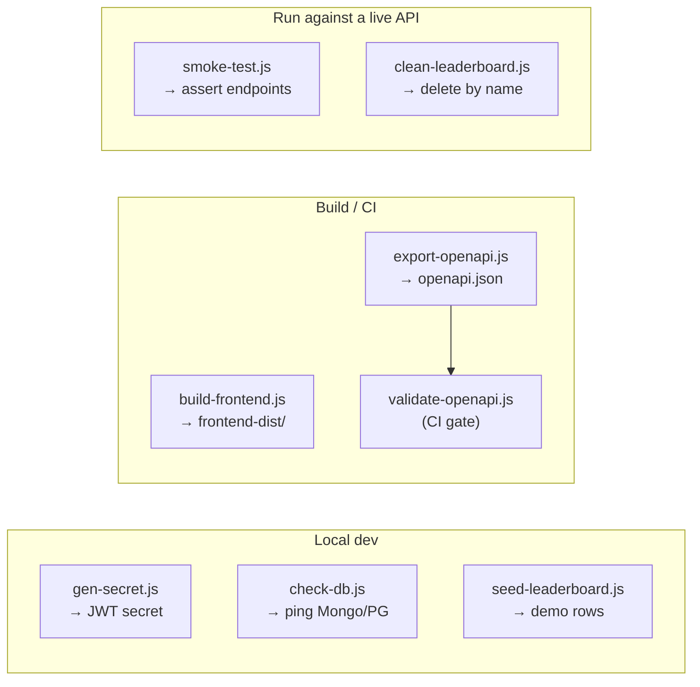

# scripts/

Project automation scripts. Most are also exposed via `package.json` scripts and
the root `Makefile`.



| Script                 | What it does                                                          |
| ---------------------- | --------------------------------------------------------------------- |
| `build-frontend.js`    | Assemble the static site into `frontend-dist/` (used by CI + Docker). |
| `gen-secret.js`        | Print a strong random secret (e.g. for `JWT_SECRET`).                 |
| `check-db.js`          | Ping the configured datastore(s) — Mongo and/or Postgres.             |
| `seed-leaderboard.js`  | Insert random demo leaderboard entries (via the active driver).       |
| `smoke-test.js`        | Hit a running API's public endpoints and assert they respond.         |
| `export-openapi.js`    | Write the OpenAPI spec to `openapi.json`.                             |
| `validate-openapi.js`  | Validate the spec (no broken `$ref`s, every op documented). CI gate.  |
| `clean-leaderboard.js` | Remove leaderboard rows from Mongo by name/prefix.                    |

## Examples

```bash
node scripts/gen-secret.js                       # JWT secret
node scripts/build-frontend.js                   # -> frontend-dist/
MONGODB_URI=... node scripts/check-db.js
MONGODB_URI=... node scripts/seed-leaderboard.js 50
API_BASE=https://maze-game-api.vercel.app node scripts/smoke-test.js
node scripts/export-openapi.js && node scripts/validate-openapi.js
MONGODB_URI=... node scripts/clean-leaderboard.js "E2E_*"
```
