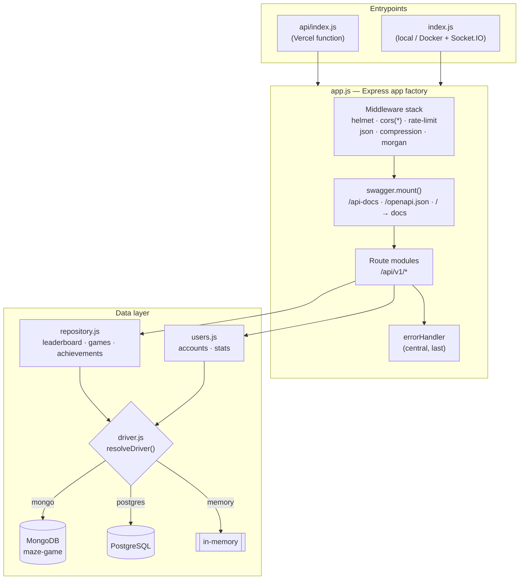
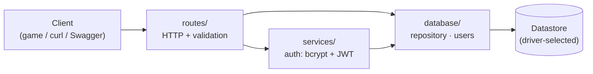
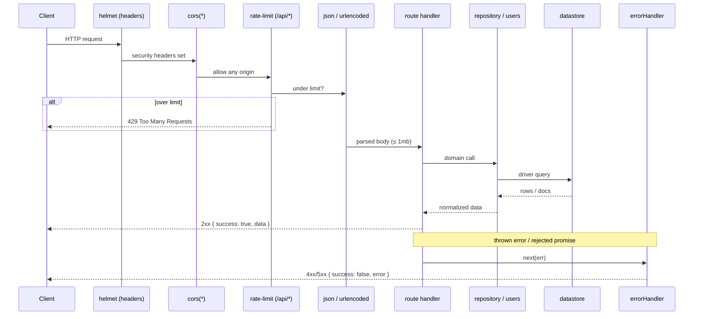
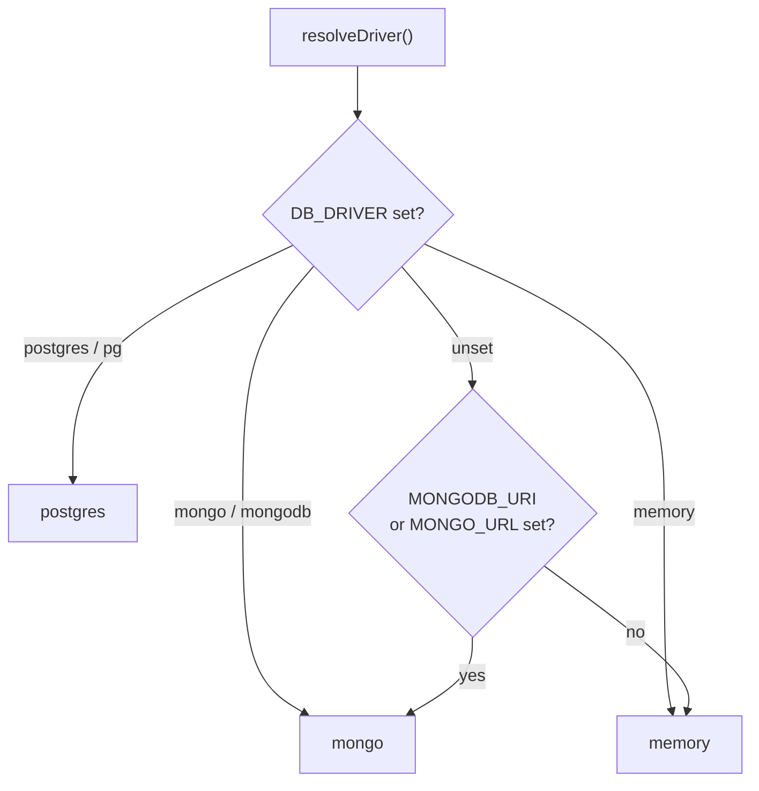
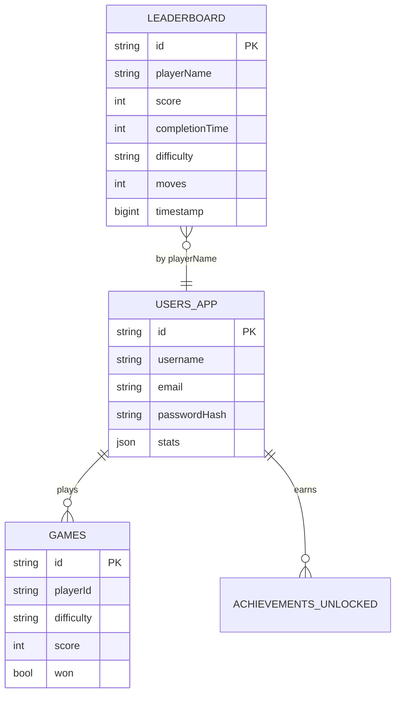
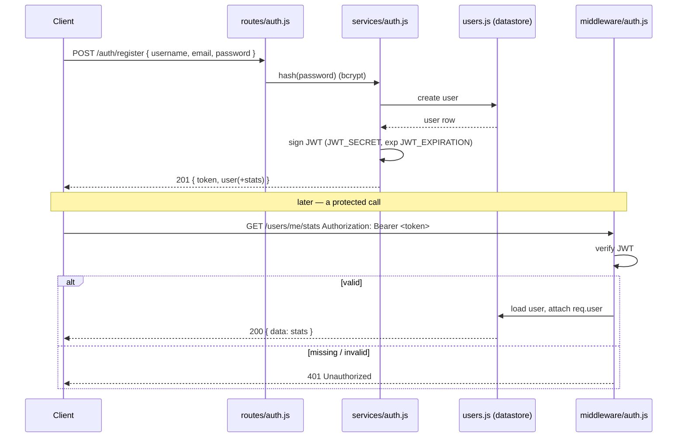
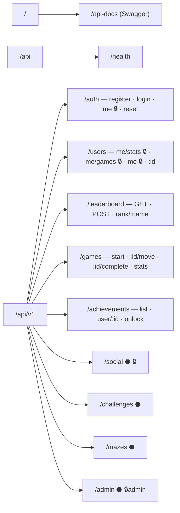
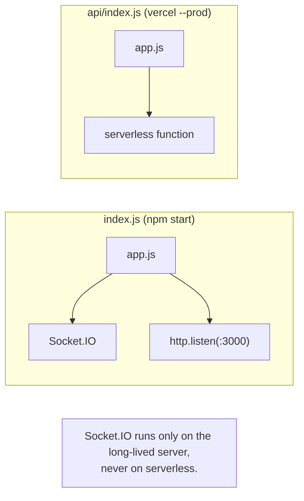
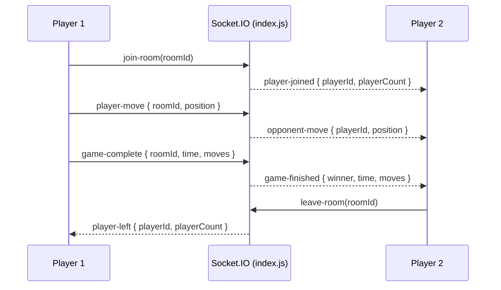

# The Maze Game — Backend (`server/`)

The Express REST API behind [The Maze Game](https://the-maze-game.onrender.com/):
leaderboards, game sessions, achievements, accounts (JWT), per-user stats &
progress, and an optional realtime multiplayer layer. It is **serverless-ready**
(one Express app deployed to Vercel as a single function) and **datastore-agnostic**
(MongoDB, PostgreSQL, or in-memory behind one repository interface).

> **Interactive docs:** Swagger UI at [`/api-docs`](https://maze-game-api.vercel.app/api-docs),
> raw OpenAPI 3.0 spec at [`/openapi.json`](https://maze-game-api.vercel.app/openapi.json).
> The full reference also lives in [`../API_DOCUMENTATION.md`](../API_DOCUMENTATION.md).

---

## Contents

- [Architecture](#architecture)
- [Request lifecycle](#request-lifecycle)
- [Datastore drivers](#datastore-drivers)
- [Authentication](#authentication)
- [Directory layout](#directory-layout)
- [Route map](#route-map)
- [Running it](#running-it)
- [Environment variables](#environment-variables)
- [Realtime multiplayer](#realtime-multiplayer)
- [Testing](#testing)

---

## Architecture

The app is built as a **factory** (`app.js`) that wires middleware, Swagger, and
routes onto an Express instance and exports it. Two thin entrypoints consume it:
`api/index.js` (Vercel serverless) and `index.js` (long-lived server that also
attaches Socket.IO and calls `listen`).



**Layering**



Routes never talk to a database client directly — they go through
`repository.js` / `users.js`, which dispatch to the active driver. Swapping
datastores touches only those two modules.

---

## Request lifecycle

Every request flows through the same middleware chain before reaching a route
handler. Errors short-circuit to the central handler.



`GET /api/health` returns the resolved driver, so you can confirm which datastore
a deployment is actually using:

```json
{
  "status": "healthy",
  "environment": "production",
  "dbDriver": "mongo"
}
```

---

## Datastore drivers

`database/driver.js` resolves the active driver once, from `DB_DRIVER` with a
sensible fallback. Both repositories share it (kept in its own module to avoid a
circular import).



| Driver     | Selected when                              | Persistence            | Source                            |
| ---------- | ------------------------------------------ | ---------------------- | --------------------------------- |
| `mongo`    | default once `MONGODB_URI` is set (active) | MongoDB db `maze-game` | `database/mongo.js`               |
| `postgres` | `DB_DRIVER=postgres`                        | relational             | `database/connection.js` + `schema-game.sql` |
| `memory`   | no DB configured / tests                   | process-local          | in `repository.js` / `users.js`   |

The Mongo and memory drivers cover the **active** gameplay + accounts surface.
The PostgreSQL driver additionally backs the social / challenges / mazes / admin
groups (`schema.sql`), which are documented in Swagger but inactive on the
default Mongo deployment.



---

## Authentication

Accounts use **bcrypt-hashed passwords** and **JWT bearer tokens**. Anonymous
play (leaderboard, sessions, achievements) needs no auth — players are keyed by a
`playerId` from `localStorage`.



Protected endpoints (🔒) require the `Authorization: Bearer <token>` header. Set
`JWT_SECRET` to enable accounts; without it, only anonymous endpoints work.

---

## Directory layout

```
server/
├── app.js                 # Express app factory (serverless-safe) — exported
├── index.js               # Local/Docker entry: app + Socket.IO + listen()
├── swagger.js             # OpenAPI 3.0 spec + CDN Swagger UI, /openapi.json, / → docs
├── database/
│   ├── driver.js          # resolveDriver(): mongo | postgres | memory
│   ├── repository.js      # leaderboard / games / achievements (all 3 drivers)
│   ├── users.js           # accounts + stats/progress (all 3 drivers)
│   ├── mongo.js           # MongoDB connection (db maze-game)
│   ├── connection.js      # PostgreSQL pool (lazy)
│   ├── schema-game.sql    # active gameplay + users_app tables (Postgres)
│   └── schema.sql         # full relational schema (social/challenges/mazes/admin)
├── services/
│   └── auth.js            # bcrypt hashing + JWT sign/verify
├── routes/                # auth, user, leaderboard, game, achievements,
│                          # admin, social, challenges, mazes
├── middleware/
│   ├── auth.js            # JWT bearer verification → req.user
│   └── errorHandler.js    # central { success:false, error } formatter
└── utils/
    ├── logger.js          # Winston (stdout default; files via LOG_TO_FILE=true)
    ├── email.js           # nodemailer (lazy; announcements)
    └── sentry.js          # optional error tracking (no-op without SENTRY_DSN)
```

---

## Route map

All versioned endpoints are mounted under `/api/v1`. 🔒 = JWT required,
🔒admin = admin role, ⬣ = PostgreSQL-only group.



| Group          | Base                    | Auth     | Status              |
| -------------- | ----------------------- | -------- | ------------------- |
| Health         | `/api/health`           | —        | active              |
| Auth           | `/api/v1/auth`          | mixed    | active              |
| Users & Stats  | `/api/v1/users`         | mixed 🔒 | active              |
| Leaderboard    | `/api/v1/leaderboard`   | —        | active              |
| Game sessions  | `/api/v1/games`         | —        | active              |
| Achievements   | `/api/v1/achievements`  | —        | active              |
| Social         | `/api/v1/social`        | 🔒       | Postgres-only ⬣     |
| Challenges     | `/api/v1/challenges`    | mixed    | Postgres-only ⬣     |
| Mazes          | `/api/v1/mazes`         | mixed    | Postgres-only ⬣     |
| Admin          | `/api/v1/admin`         | 🔒admin  | Postgres-only ⬣     |

Full request/response shapes: [`../API_DOCUMENTATION.md`](../API_DOCUMENTATION.md)
and Swagger.

---

## Running it

```bash
# from the repo root
npm install

# in-memory (no DB) — fine for local play & tests
npm start                      # long-lived server + Socket.IO on :3000
npm run dev                    # same, with hot reload (nodemon)

# with MongoDB
MONGODB_URI="mongodb+srv://…" MONGODB_DB=maze-game JWT_SECRET="$(node scripts/gen-secret.js)" npm start

# Swagger UI:        http://localhost:3000/api-docs
# Health + driver:   http://localhost:3000/api/health
```



**Docker:** `Dockerfile.backend` builds this server on `node:20-bookworm-slim`;
`docker compose up` runs it alongside MongoDB. See the root README's Deployment
section.

---

## Environment variables

| Variable                                          | Required          | Default     | Notes                                            |
| ------------------------------------------------- | ----------------- | ----------- | ------------------------------------------------ |
| `PORT`                                            | no                | `3000`      | Long-lived server port                           |
| `NODE_ENV`                                        | recommended       | `development` | `production` enables combined logs              |
| `DB_DRIVER`                                       | no                | auto        | `mongo` · `postgres` · `memory`                  |
| `MONGODB_URI`                                     | for Mongo         | —           | Enables the `mongo` driver                       |
| `MONGODB_DB`                                      | no                | `maze-game` | Mongo database name                              |
| `JWT_SECRET`                                      | for accounts      | —           | Signs auth tokens (generate a long random value) |
| `JWT_EXPIRATION`                                  | no                | `7d`        | Token TTL                                        |
| `BCRYPT_ROUNDS`                                   | no                | `10`        | Password hash cost                               |
| `DATABASE_URL` / `DB_*`                           | for Postgres      | —           | Used when `DB_DRIVER=postgres`                   |
| `RATE_LIMIT_WINDOW_MS` / `RATE_LIMIT_MAX_REQUESTS`| no                | `900000` / `100` | Rate-limit window / cap                      |
| `LOG_TO_FILE`                                     | no                | `false`     | Also write Winston logs to files                 |
| `SENTRY_DSN`                                      | no                | —           | Enables error tracking                           |

```bash
# generate a strong JWT secret
node scripts/gen-secret.js
# or
node -e "console.log(require('crypto').randomBytes(48).toString('hex'))"
```

---

## Realtime multiplayer

`index.js` attaches Socket.IO to the HTTP server. The serverless deployment does
**not** run it (functions are short-lived).



The infrastructure is in place; a multiplayer frontend is on the roadmap.

---

## Testing

```bash
npm test                       # Jest + Supertest (server suites use node env)
npm test -- __tests__/server   # backend only
npm run format:check           # Prettier gate (skips *.md)
node scripts/validate-openapi.js   # every operation documented, no broken $ref
node scripts/smoke-test.js     # hit a running API's public endpoints
```

Server suites run in the `node` Jest environment (`@jest-environment node`
docblocks) and mount the real `app.js`, so they exercise the full middleware
chain against the in-memory driver.
