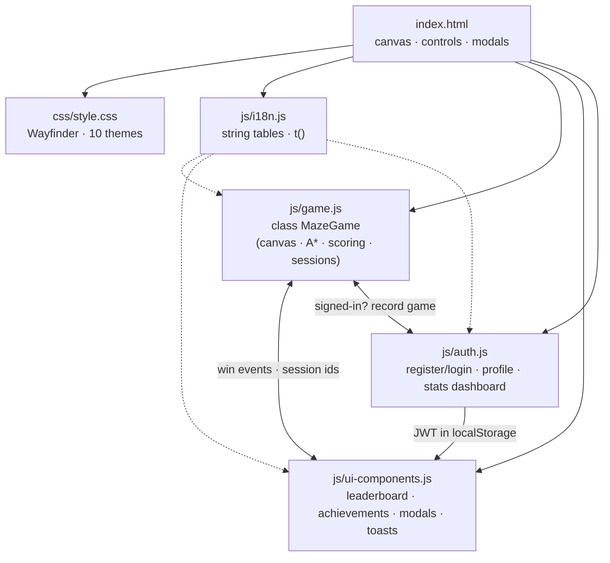
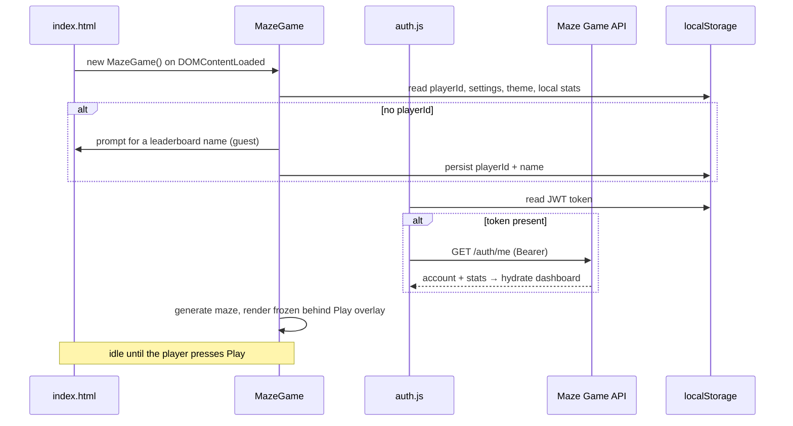
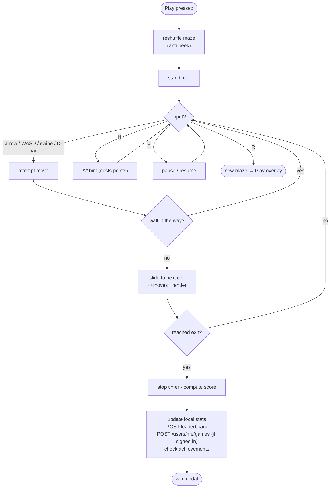
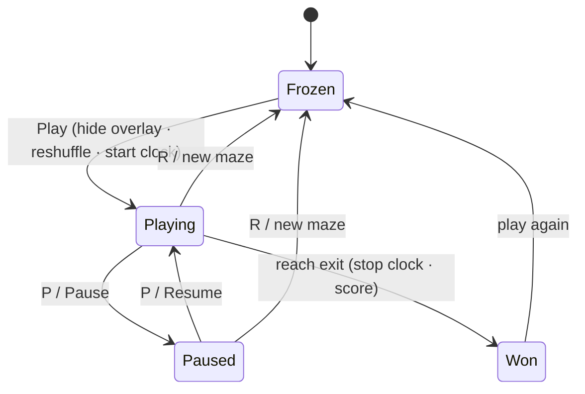
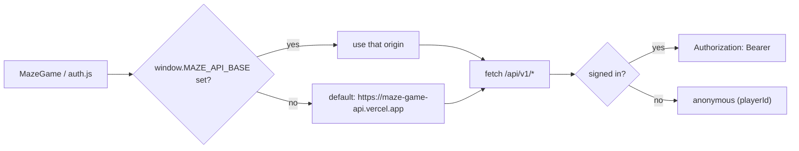
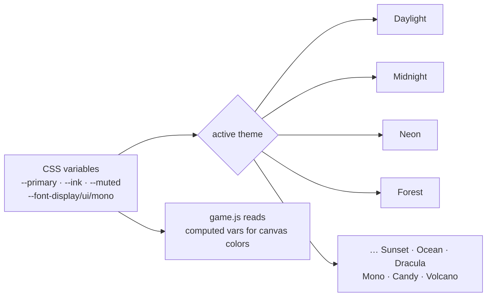
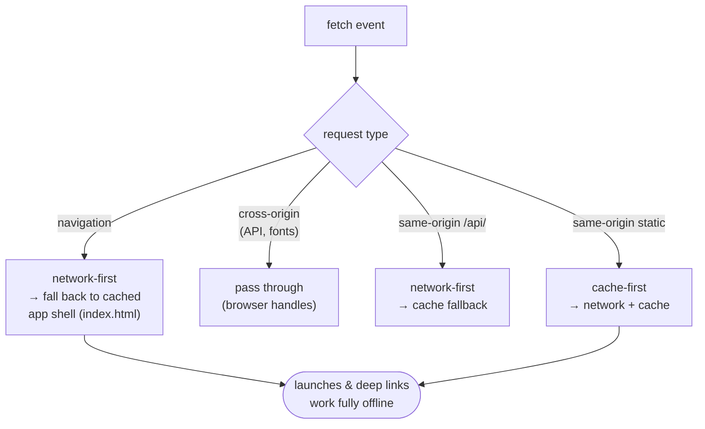
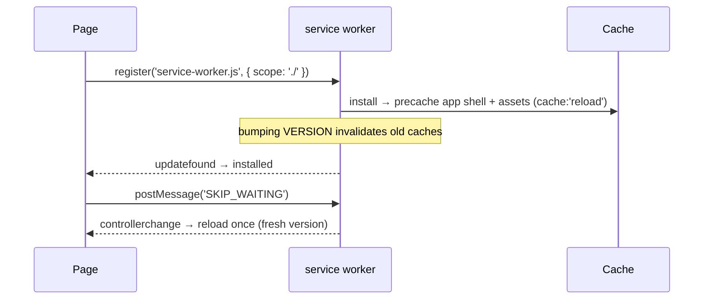

# The Maze Game — Frontend (`src/`)

The browser game: a **vanilla-JS, zero-framework** client rendered on an HTML5
canvas, styled by the "Wayfinder" design system, and talking to the
[Maze Game API](../API_DOCUMENTATION.md). It deploys as static files (Render /
GitHub Pages) — no build step is required to run it, though `scripts/build-frontend.js`
can assemble a `frontend-dist/` for Docker/CI.

> Live: **<https://the-maze-game.onrender.com/>** · API:
> **<https://maze-game-api.vercel.app>**

---

## Contents

- [Module map](#module-map)
- [Runtime boot sequence](#runtime-boot-sequence)
- [Game loop](#game-loop)
- [Start-gate state machine](#start-gate-state-machine)
- [Talking to the API](#talking-to-the-api)
- [Directory layout](#directory-layout)
- [Styling & theming](#styling--theming)
- [Progressive Web App](#progressive-web-app)
- [Running locally](#running-locally)
- [The `python/` subfolder](#the-python-subfolder)

---

## Module map

Four ES scripts load in order from `index.html`. There is no bundler at runtime —
they share state through a small set of globals and the DOM.



| File                  | Responsibility                                                                 |
| --------------------- | ------------------------------------------------------------------------------ |
| `js/game.js`          | The engine: maze generation, canvas render, input, A\* hints, timer, scoring, server game sessions, themes, start gate. |
| `js/ui-components.js` | Reusable UI: leaderboard table, achievements grid, modals, toasts, settings.   |
| `js/auth.js`          | Accounts: register/login/reset, profile editing, the per-user stats dashboard. |
| `js/i18n.js`          | Lightweight i18n string tables + a `t()` lookup helper.                        |
| `css/style.css`       | The whole visual system (see [Styling & theming](#styling--theming)).          |
| `html/about.html`     | Standalone About page.                                                         |

---

## Runtime boot sequence



---

## Game loop

The maze stays frozen until **Play**. Once started, input drives discrete moves
(the player slides cell-to-cell); each frame re-renders the canvas. A win stops
the clock, computes the score, and reports it.



**Scoring** mirrors the server (so client and API agree):

```
baseScore 100 − time·0.1/s − moves·0.5 − hints·cost, then × difficulty multiplier
difficulty multiplier: easy 1.0 · medium 1.5 · hard 2.0 · expert 3.0
```

---

## Start-gate state machine

The "frozen maze + Play overlay" is an explicit state machine. Pressing Play
**reshuffles** the maze, so anything glimpsed through the translucent overlay is
invalidated before the clock starts.



---

## Talking to the API

The client defaults to the hosted API and degrades gracefully when offline
(local stats still work). Override the base URL before the scripts load:

```html
<script>
  window.MAZE_API_BASE = 'http://localhost:3000';
</script>
```



Endpoints the frontend uses: `GET/POST /leaderboard`, `POST /games/*`,
`GET /achievements` + `POST /achievements/unlock`, and (when signed in)
`/auth/*` and `/users/me/*`. See [`../API_DOCUMENTATION.md`](../API_DOCUMENTATION.md).

---

## Directory layout

```
src/
├── css/
│   └── style.css          # Wayfinder design system + 10 themes
├── js/
│   ├── game.js            # class MazeGame — engine, render, input, scoring
│   ├── ui-components.js   # leaderboard, achievements, modals, toasts
│   ├── auth.js            # accounts, profile, stats dashboard
│   └── i18n.js            # i18n string tables + t()
├── html/
│   └── about.html         # About page
├── python/                # `mazeforge` — the standalone Python maze library
└── README.md              # (this file)
```

---

## Styling & theming

`css/style.css` is the entire visual system — there is no CSS framework. It
defines design tokens as CSS custom properties and switches **10 themes** by
swapping a small set of variables on a root attribute.



- **Fonts:** Bricolage Grotesque (display) · Sora (UI) · JetBrains Mono (code/time).
- **Responsive:** mobile-first; on phones (~360px) the maze + controls stack
  above stats, with swipe and an on-screen D-pad. No horizontal overflow.
- **Canvas colors** are read from the computed CSS variables, so the maze
  re-themes in lockstep with the UI.

---

## Progressive Web App

The game is an installable, offline-capable PWA. Two root-level files drive it —
[`manifest.json`](../manifest.json) and [`service-worker.js`](../service-worker.js) —
and registration + the install button live in `js/ui-components.js`. Every path
is relative and the worker is scoped `./`, so it works at the domain root
(Render) and under a sub-path (GitHub Pages) alike.

**Caching strategy**



**Lifecycle & updates**



- **App shell offline:** any navigation falls back to the cached `index.html`, so
  the game opens with no network.
- **Fresh precache:** assets are precached with `cache: 'reload'`, so a `VERSION`
  bump always pulls the latest files (no stale-asset traps).
- **Install button:** `beforeinstallprompt` is captured and surfaced as an
  in-header **Install** button; `appinstalled` hides it (both tracked via GA).
- **Manifest:** standalone display, ink theme/background, `any` + `maskable`
  icons, **shortcuts** (Play, About), and **screenshots** for a rich install UI.

---

## Running locally

No build needed — it's static:

```bash
# from the repo root
npm run serve            # http-server → opens index.html
# or any static server:
python3 -m http.server 8080      # then open http://localhost:8080
```

Point it at a local backend by setting `window.MAZE_API_BASE` (see above), or
just play offline — local stats persist in `localStorage`.

To produce the deployable bundle (used by Docker/CI):

```bash
node scripts/build-frontend.js   # → frontend-dist/
```

---

## The `python/` subfolder

`src/python/` is **not** part of the web client — it's `mazeforge`, a standalone,
installable, typed Python library (11 generators, 7 solvers, ASCII/PNG render, a
CLI, and a pygame player). It shares the maze *concepts* but ships and tests
independently. See [`python/README.md`](./python/README.md).
