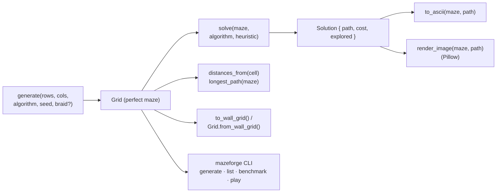
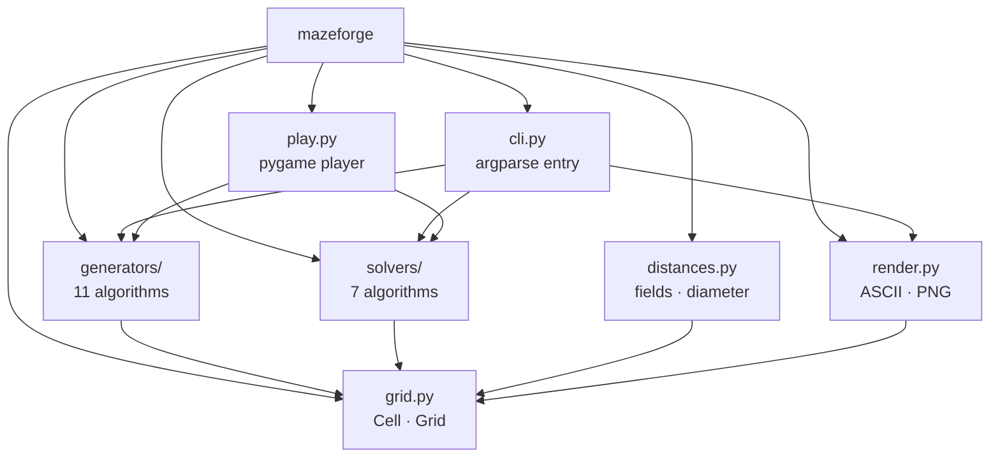

# mazeforge

Production-grade **maze generation, solving, and rendering** for Python — the
algorithmic engine behind [The Maze Game](https://github.com/hoangsonww/The-Maze-Game),
packaged as a clean, typed, dependency-free library that any app or dev can use.

- **11 generation algorithms** — recursive backtracker, Prim, Kruskal, Wilson,
  Aldous-Broder, hunt-and-kill, Eller, recursive division, binary tree,
  sidewinder, growing tree.
- **7 solvers** — BFS, DFS, Dijkstra, A\* (Manhattan / Euclidean / Chebyshev),
  greedy best-first, wall follower, dead-end filling.
- **Distance fields & diameter** — Dijkstra/BFS fields and longest-path discovery.
- **Rendering** — ASCII (with path/distance overlays) and PNG (optional Pillow).
- **Interop** — convert to/from a `(2r+1)×(2c+1)` wall grid.
- **Typed** (`py.typed`), reproducible (seedable), zero core dependencies.

## Pipeline



## Module layout



## Install

```bash
pip install ./src/python                # core library
pip install "./src/python[image]"       # + PNG rendering (Pillow)
pip install "./src/python[play]"        # + interactive pygame player
```

(Published name: `mazeforge` — once on PyPI: `pip install mazeforge`.)

## Library usage

```python
import mazeforge as mf

maze = mf.generate(20, 30, algorithm="recursive_backtracker", seed=42)

solution = mf.solve(maze, algorithm="astar", heuristic="manhattan")
print(f"{solution.cost} steps, {solution.explored} cells explored")

print(mf.to_ascii(maze, path=solution.path))     # ASCII with the path drawn
mf.render_image(maze, path=solution.path, save_to="maze.png")  # PNG (needs Pillow)

# Distance field + the maze's longest possible run:
field = mf.distances_from(maze.cell_at(0, 0))
hardest = mf.longest_path(maze)

# Interop with wall-grid mazes (e.g. the web game):
walls = maze.to_wall_grid()                      # list[list[int]] 1=wall 0=path
same = mf.Grid.from_wall_grid(walls)
```

Every generated maze is **perfect** (a spanning tree — exactly one path between
any two cells) unless you `braid` it:

```python
loopy = mf.generate(20, 20, "prim", seed=1, braid=0.5)   # remove 50% of dead ends
```

## CLI

```bash
mazeforge generate -r 20 -c 30 --algo wilson --solve          # ASCII maze + path
mazeforge generate -r 25 -c 25 --algo prim --format png --out maze.png --solve
mazeforge generate -r 12 -c 12 --format wall                  # 0/1 wall grid
mazeforge list                                                # all algorithms
mazeforge benchmark -r 40 -c 40                               # time everything
mazeforge play                                                # interactive: WASD/arrows, H=hint, R=new
```

(Or `python -m mazeforge …` without installing the console script.)

## Algorithms at a glance

| Generator | Character | Bias |
| --- | --- | --- |
| `recursive_backtracker` | long winding corridors | none (DFS) |
| `growing_tree` | tunable (newest→backtracker, random→Prim) | strategy-dependent |
| `prim` / `kruskal` | many short branches | none |
| `wilson` / `aldous_broder` | uniform spanning tree | unbiased |
| `hunt_and_kill` | long corridors, few dead ends | mild |
| `eller` | row-by-row, O(1) memory | none |
| `recursive_division` | roomy, straight walls | structural |
| `binary_tree` / `sidewinder` | very fast, O(n) | strong diagonal |

| Solver | Optimal? | Notes |
| --- | --- | --- |
| `bfs`, `dijkstra`, `astar`, `dead_end_filling` | ✅ shortest | A\* expands the fewest nodes |
| `greedy` | ❌ | fast, heuristic-guided |
| `dfs`, `wall_follower` | ❌ | find *a* path |

## Development

```bash
pip install "./src/python[dev]"
pytest src/python            # run the test suite
mypy src/python/mazeforge    # type-check
```

## License

MIT — see the repository `LICENSE`.
